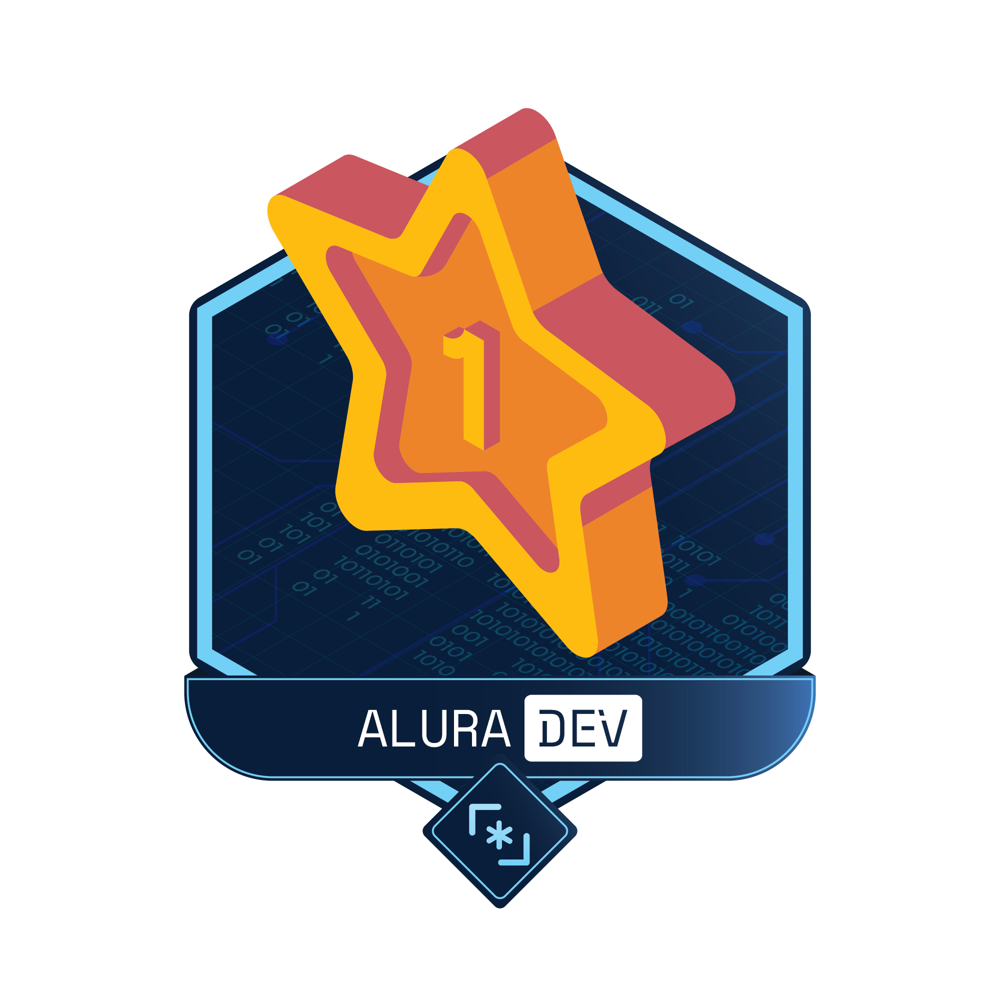
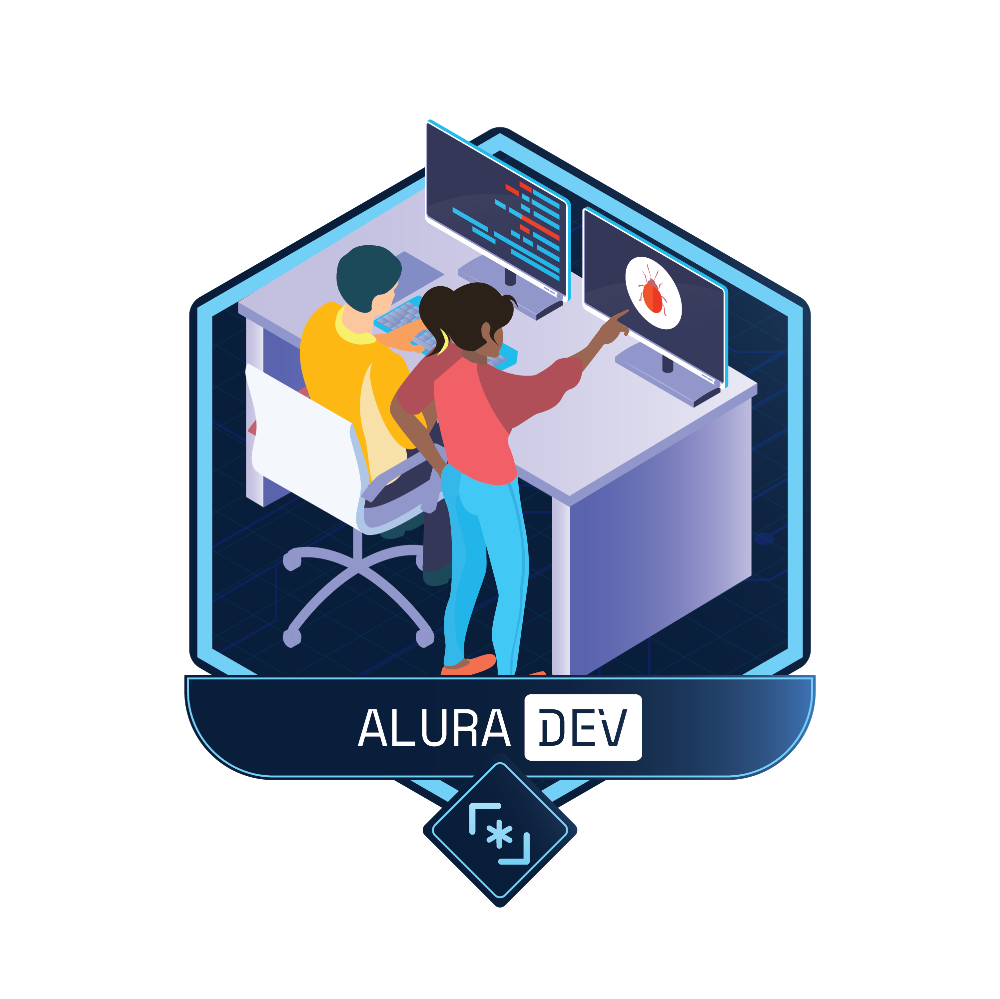

<!-- Chamando estilização do Readme -->
<link rel="stylesheet" href="./ReadmeAssets/readme.css">
<!-- Div apenas para centralizar o badge -->
<div class=center align="center">
<!-- badge na nuvem -->
  
<!--  -->

<!-- Badge Local -->
<!--  -->



[](https://twitter.com/intent/follow?screen_name=moisesgobila)
<!-- [](https://twitter.com/moisesgobila/intent/tweet?text=Wow:&url=https%3A%2F%2Ftwitter.com%2Fmoisesgobila) -->
</div>

# AluraDev
Desafio proposto pela Alura para a criação de uma ferramenta de compartilhamento de codigo, semelhante ao https://carbon.now.sh/ com o adicional de uma pagina de comunidade, onde usarios possam vê o codigo de outras pessoas.

[LINK DEMO](https://alura-dev-lake.vercel.app/)

## Tecnologia usadas
Para fazer o screenshot foi usada a biblioteca Html2Canvas, você pode revisar o arquivo screenshot.js para escolher a div para gerar a imagem.<br><br>
Em conjunto foi usanda a biblioteca HighlightJs para dar a sintaxy do codigo criado em na pagina de editor. complementar ao Highlight na pasta Css/temas-hljs exitem dois estilos estilos que podem ser usados apenas importando o aquivo na pagina do editor apenas um estilo pode ser usado po vez. O arquivo Js/sintaxyFormat.js é usado para selecionar o container onde o Highlight é aplicado.
<br><br>
Esse projeto usa SASS como forma de criar os estilos por isso é recomendado, que se você quiser fazer alterações, usar o SASS e não o CSS diretamente.
Caso você use o VSCode e já tenha o SASS instaldo, na pasta .vscode existe um script para iniciar o SASS direto no terminal integrado, basta apenas usar o atalho ```Shift+Ctrl+B``` e selecionar SassCompiler.
<br><br>
O padrão CSS utilizado nesse projeto se basea no BEM. Veja abaixo:
````
.Bloco__Elemento_Subelemento-modificador
````
## Sujestão para uma proxima versão?

1. Criar/refatorar para uma versão SPA;
2. Criar seleção de temas darkmode e lightmode;
3. Pagina de Usuario
